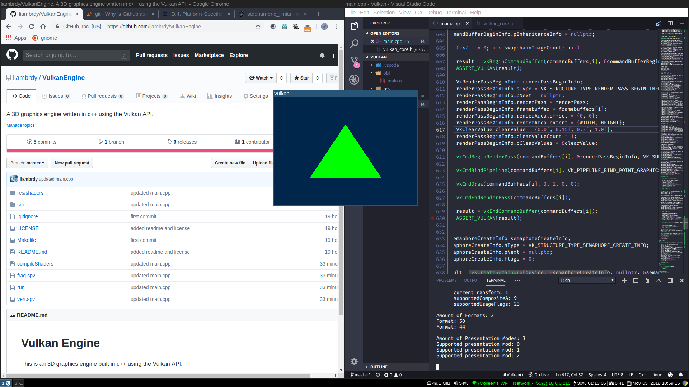

# Vulkan Engine

This is an 3D graphics engine built in c++ using the Vulkan API.

### Dependencies

- [The Vulkan SDK](https://vulkan.lunarg.com/)
- [GLFW](https://www.glfw.org/)
- [glslangValidator](https://github.com/KhronosGroup/glslang)

### Install

- Install the dependencies
- `git clone https://github.com/liambrdy/VulkanEngine.git`
- `cd VulkanEngine`

### First Render!!!

### License

This project is licensed under the MIT License - see the [LICENSE](LICENSE) file for details
